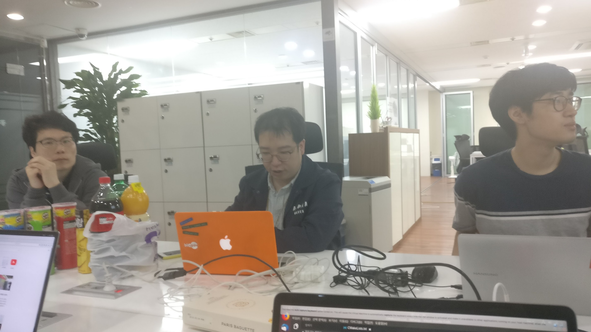
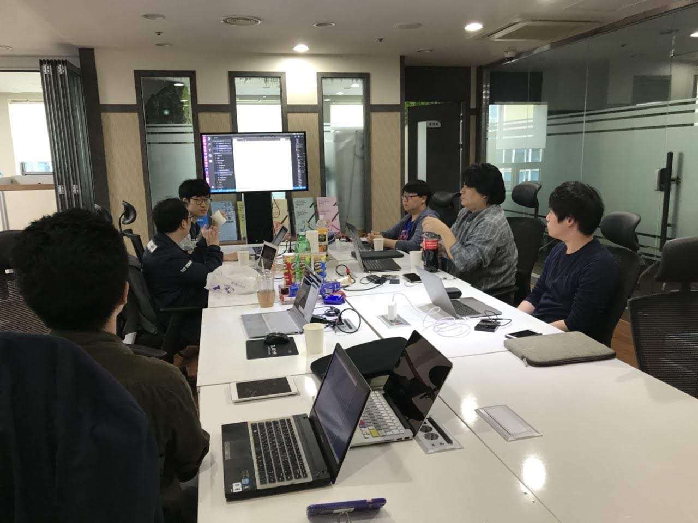
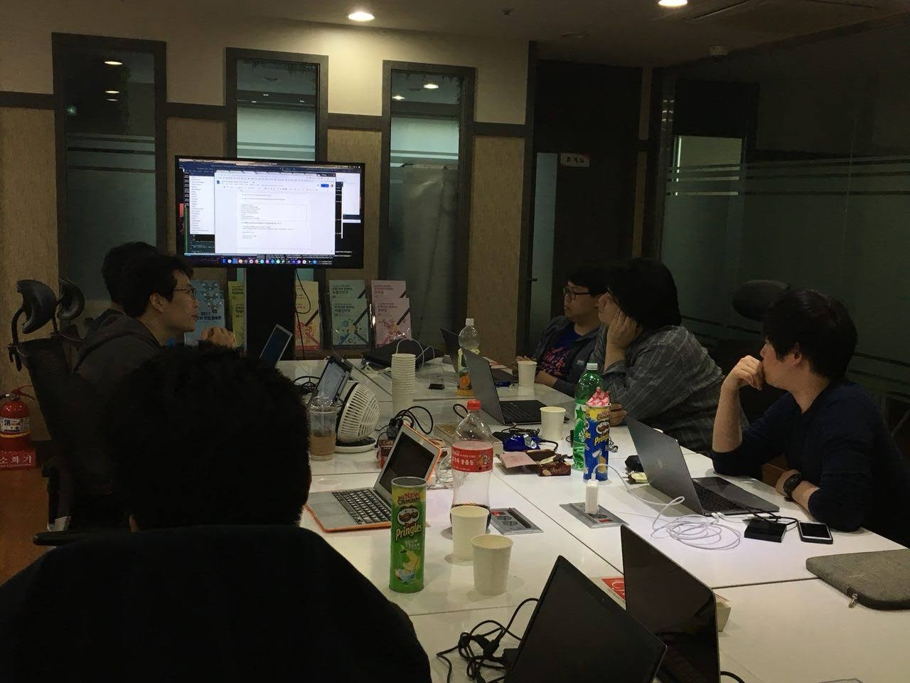

Today(May 19, 2018), Our Hanjp-IM Team from Ubuntu Korea Community, opened a joint meetup with GNOME Korea.
This joint meetup was organized with the suggestion from Seong-Ho Cho, from GNOME Korea. who attended Ubuntu 18.04 LTS Release Party @ Seoul.
After he watched the presentation about status of Hanjp-IM Project, he suggested us a joint meetup because he wanted to help our project.
Since we have many difficulties with developing input method because all of us are begineer in input method field, We have accepted the suggestion wo that we can get some help with our project from the people knows manh things about iBus and input method.

The meetup was hold at KossLab located at the 7th floor of the anam tower.

## 1. Summary of how hangul is processed
First, Seong-Ho Cho from GNOME Korea described about how hangul input is processed. He introduced 3 diffreent software : libhangul a library for processing hanugl input, iBus a very well known input method for linux desktop, and ibus-hangul implemented with ibus and libhangul. He also presented us how those are works and its architectures by showing us some state diagram.

## 2. Outline of hangul input in linux desktop
Changwoo Ryu from GNOME Korea described about how hangul input is processed in linux desktop. He emphasized that problems that occurs when typing hangul(such as disappearing of last character when pressing space) isn't just because of input methods. But it's a complex problem since other various softwares are also related and participate with input processing. To describe this much better he showed us some diagram of input processing scenarios. Since not just X.org but Wayland also have to be considered when processing input these days, He also introduced some functions included in Wayland that processed keyboard input itself.

## 3. Hanjp-IM Project Intrduction
Gwangyeon Kim, who leads our Hanjp-IM Project, introduced about our Hanjp-IM Project by showing some piece of codes from libhanjp which provide similar features to libhangul. he described how libhanjp uses libhangul to process Japanese Kana thorugh typing Korean Hangul. After his introduction, We talked about solving out some problems of our project, what kind of options should we put to build, and fixing errors from libhanjp. We also tried to write and test test code for libhanjp. Gwan-gyeong Mun and Changwoo Ryu help him with writting code, Makefile writting and gcc build options, and debugging with gdb.

## 4. Setting up development environment for GNOME with jhbuild, and how to build, test, and submit issue
Gwan-gyeong Mun from GNOME Korea introduced about setting up development environment, building, testing GNOME with jh build. and also submitting issues to GNOME Project.
He also showed us how to use looking glass a tool for debugging Gjs(Javascript binding for GNOME) by demonstrating inspection of components on GNOME Shell and other features from looking glass.

Through this joint meetup with GNOME Korea our Hanjp-IM team could get a lot of help with the project, and it was a great opertunitty to think about which way should we choose for progress of the project and what we actually have to do to do it.
With this meetup, it's already 20th meetup for our project. If we got right way for the project, we'll be able to make a quick progress and also launch a first version much quicker.

## Links
- [Summary of how hangul is processed (Slides)](https://www.slideshare.net/gnomekr/20180519-hangul-processing)
- [Outline of hangul input in linux desktop (Slides)](https://www.slideshare.net/gnomekr/korean-input-overview-in-the-linux-desktop)
- [Setting up development environment for GNOME and debugging tips (Gwan-gyeong Mun's document from his Google Docs)](https://docs.google.com/document/d/1F5Yf515SgZPimIujRmTgbtY78aVLWS3EpU_z5TRyIJs/edit)
- [JavaScript Debugging (GNOME Wiki)](https://wiki.gnome.org/Projects/GnomeShell/DebuggingJavaScript)
- [2018년 5월 그놈 모임 회고 - 그놈 한국 블로그(GNOME KOREA Blog)](http://gnome-kr.blogspot.kr/2018/05/2018-5.html)
- [Hanjp-IM Project GitHub Repo](https://github.com/ubuntu-kr/hanjp-im)
- [Hanjp-IM Project Document on Ubuntu Korea Community Wiki](https://wiki.ubuntu-kr.org/index.php/HanJP_IM)
- [Hanjp-IM Project meetups photo album](https://photos.app.goo.gl/9hBFNe0jwk40xzox1)

## Photos
Some photos were taken by Gwan-gyeong Mun. Thanks for the photos.

